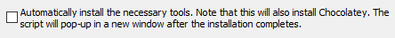

# Node.js

建议直接使用 nvm 安装, 方便版本管理

## NVM

- [安装nvm](https://nodejs.org/zh-cn/download)

## Windows

官网下载对应版本LTS

- 自定义安装: 其实默认安装就可以了 非必要的在线文档等功能也占用不了多少空间 仅1M左右
    - [X] runtime: 安装运行环境
    - [X] npm package manager: 安装npm包管理工具
    - [X] Add to PATH: 添加到环境变量
    -  这个不要勾选 会影响安装速度 自己安装 C/C++ & python
    - 验证: `node -v` `npm -v`
- 配置npm包的安装路径:
    - 查看路径: `npm config get prefix` `npm config get cache`
    - 手动创建文件夹: `D:\ProgramData\nodejs\node_global` `D:\ProgramData\nodejs\node_cache`
    - 修改权限: 两个文件夹可以写入
    - `npm config set prefix "D:\ProgramData\nodejs\node_global"`  
      `npm config set cache "D:\ProgramData\nodejs\node_cache"`
    - 修改环境变量: `C:\Users\lemon\AppData\Roaming\npm` --> `D:\ProgramData\nodejs\node_global`
    - 修改npm源: `npm config set registry=https://registry.npmmirror.com/`
    - 参考来源: [npm包安装路径1](https://blog.csdn.net/thefg/article/details/132410794 "npm包安装路径")
      [npm包安装路径2](https://blog.csdn.net/Nicolecocol/article/details/136788200 "npm包安装路径")  