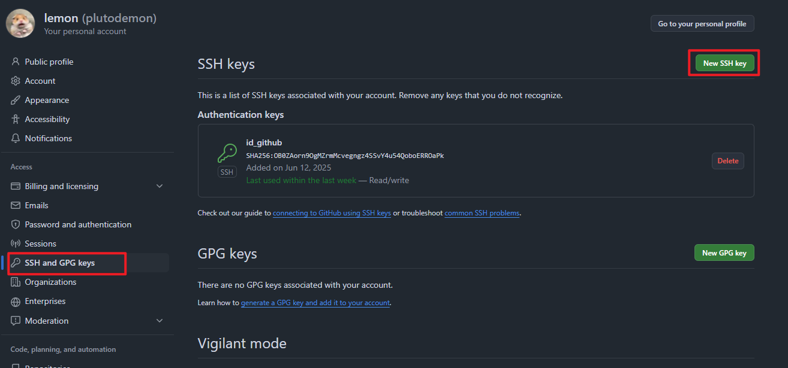

# Git

## 推送远程仓库

- 远程创建好仓库 本地 `git clone`
- 把git提交的用户名和邮箱改一下 只改成此项目的
  ``` bash
  git config user.name lemon
  ```

  ``` bash
  git config user.email 101779730+plutodemon@users.noreply.github.com
  ```

    - 但是貌似也可以ide里面修改成github的用户名
    - 还可以添加ssh 或者 gpg 密钥验证 但是这个用不到目前 比较啥也不是现在

- 上传了一下之间的软件包 unzipPW：kitkitkit (这儿应该只有我知道吧)

## 配置公钥

- 生成公钥私钥见 [Linux.md 生成公钥私钥](Linux.md#生成公钥私钥)
  随后将公钥添加到github上
  
- 随后在需要用git的添加私钥配置
    - 创建或编辑 `~/.ssh/config` 文件
    - 修改权限 添加内容
  ```bash
  chmod 600 ~/.ssh/config
  ```
  ```text
  Host github.com
    HostName github.com
    User git
    IdentityFile ~/.ssh/my_github_key
    IdentitiesOnly yes
  ```
- 测试连接
  ```bash
  ssh -T git@github.com
    ```

## GitHub Actions

创建工作流 推送代码后自动部署到服务器

- 在项目根目录下创建 `.github/workflows/deploy.yml`
- example 内容如下
  ```yaml
  name: Deploy MyDaily to Ubuntu Server
    
  on:
    push:
      branches:
        - master
    
  jobs:
    deploy:
      runs-on: ubuntu-22.04
    
      env:
        SSH_HOST: ${{ secrets.SSH_HOST }}
        SSH_USER: ${{ secrets.SSH_USER }}
        SSH_KEY: ${{ secrets.SSH_PRIVATE_KEY }}
        REMOTE_PATH: "/code/my_daily"
        DEPLOY_DIR: "/var/www/vitepress"
    
      steps:
        - name: Checkout code
          uses: actions/checkout@v4
    
        - name: Setup SSH and Deploy
          run: |
            # 设置 SSH（在 GitHub 虚拟机上）
            mkdir -p ~/.ssh
            echo "$SSH_KEY" > ~/.ssh/id_rsa
            chmod 600 ~/.ssh/id_rsa
            ssh-keyscan -H $SSH_HOST >> ~/.ssh/known_hosts
    
            # 在云服务器上执行所有部署操作
            ssh -i ~/.ssh/id_rsa $SSH_USER@$SSH_HOST << EOF
              set -e  # 遇到错误立即退出
    
              echo "=== 加载 nvm 环境 ==="
              export NVM_DIR="\$HOME/.nvm"
              [ -s "\$NVM_DIR/nvm.sh" ] && \. "\$NVM_DIR/nvm.sh"
              [ -s "\$NVM_DIR/bash_completion" ] && \. "\$NVM_DIR/bash_completion"
    
              echo "=== 检查环境 ==="
              node --version
              npm --version
    
              echo "=== 拉取最新代码 ==="
              echo "当前目录: \$(pwd)"
              echo "目标目录: \$(pwd)$REMOTE_PATH"
    
              cd \$(pwd)$REMOTE_PATH
              echo "切换到目录: \$(pwd)"
    
              git pull origin master
    
              echo "=== 安装依赖并构建 ==="
              npm install
              npm run build
    
              echo "=== 部署到服务器 ==="
              # 清理部署目录
              rm -rf $DEPLOY_DIR/*
    
              # 复制构建文件
              mv .vitepress/dist/ $DEPLOY_DIR
    
              # 创建图片目录并复制图片
              mkdir -p -m 755 $DEPLOY_DIR/dist/img
              cp -r src/img/* $DEPLOY_DIR/dist/img/
    
              echo "=== 重启服务 ==="
              sudo systemctl restart nginx
              sudo systemctl status nginx --no-pager
    
              echo "=== 部署完成 ==="
            EOF
  ```